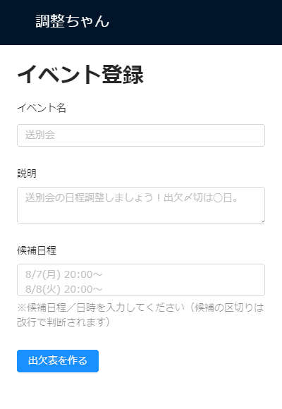

# 1.イベントを登録する

### 画面イメージ




### 対象ファイル

- <project_root>/src/EventEntry.js

### 完成コード

初めに、完成コードを示しておきます。

```javascript

class EventEntry extends React.Component {
    constructor(props) {
        super(props);
        this.state = {
            eventName: '',
            description: '',
            candidateText: ''
        };
    }

    registerEvent = async (evt) => {
        evt.preventDefault();
        const { eventName, description, candidateText } = this.state;
        const candidateDates = candidateText.split('\n');
        const eventId = await firebaseDb.ref("events").push({ eventName, description, candidateDates }).key;
        this.props.history.push(`/event/${eventId}`);
    }

    onChangeEventName = (evt) => {
        this.setState({
            eventName: evt.target.value
        });
    }

    onChangeDescription = (evt) => {
        this.setState({
            description: evt.target.value
        });
    }

    onChangeCandidateText = (evt) => {
        this.setState({
            candidateText: evt.target.value
        });
    }

    render() {
        return (
            <div>
                <Title level={2}>イベント登録</Title>
                <Form onSubmit={this.registerEvent}>
                    <Form.Item label="イベント名">
                        <Input value={this.state.eventName} onChange={this.onChangeEventName}
                            placeholder='送別会' />
                    </Form.Item>
                    <Form.Item label="説明">
                        <Input.TextArea value={this.state.description} onChange={this.onChangeDescription}
                            placeholder='送別会の日程調整しましょう！出欠〆切は◯日。'>
                        </Input.TextArea>
                    </Form.Item>
                    <Form.Item label="候補日程" extra="※候補日程／日時を入力してください（候補の区切りは改行で判断されます）">
                        <Input.TextArea value={this.state.candidateText} onChange={this.onChangeCandidateText}
                            placeholder='8/7(月) 20:00～&#13;&#10;8/8(火) 20:00～&#13;&#10;8/9(水) 21:00～'>
                        </Input.TextArea>
                    </Form.Item>
                    <Form.Item>
                        <Button type="primary" htmlType="submit">出欠表を作る</Button>
                    </Form.Item>
                </Form>
            </div>
        );
    }
}

export default withRouter(EventEntry);

```
---
## 1-1.入力フォームを作ろう

`render`メソッドにJSXを記述して、まずは入力フォームが画面に表示されるようにしましょう。

### 対象ファイル

- <project_root>/src/EventEntry.js

### コード例

``` javascript

render() {
    return (
        <div>
            <Title level={2}>イベント登録</Title>
            <Form onSubmit={this.registerEvent}>
                <Form.Item label="イベント名">
                    <Input placeholder='送別会' />
                </Form.Item>
                <Form.Item label="説明">
                    <Input.TextArea placeholder='送別会の日程調整しましょう！出欠〆切は◯日。'>
                    </Input.TextArea>
                </Form.Item>
                <Form.Item label="候補日程" extra="※候補日程／日時を入力してください（候補の区切りは改行で判断されます）">
                    <Input.TextArea placeholder='8/7(月) 20:00～&#13;&#10;8/8(火) 20:00～&#13;&#10;8/9(水) 21:00～'>
                    </Input.TextArea>
                </Form.Item>
                <Form.Item>
                    <Button type="primary" htmlType="submit">出欠表を作る</Button>
                </Form.Item>
            </Form>
        </div>
    );
}

```

### Ant Design

ここでは、[Ant Design](https://ant.design/docs/react/introduce)で用意されたコンポーネントを配置していきます。

公式ドキュメントにサンプルがあります。

- [タイトルや文字](https://ant.design/components/typography/)
- [入力フォーム](https://ant.design/components/form/)
- [テキストフィールド](https://ant.design/components/input/)
- [ボタン](https://ant.design/components/button/)


### 入力項目

入力項目は以下の3つを用意してください。

| 項目       | プロパティ名 | 使用するコンポーネント | 備考               |
|------------|--------------|------------------------|--------------------|
| イベント名 | eventName    | Input                  |                    |
| 説明       | description  | TextArea               |                    |
| 候補日程   | candidateText   | TextArea               | 候補の区切りは改行 |

---
## 1-2.入力フォームの内容をstateに反映しよう

フォームに入力された内容を`state`に保存します。

### 対象ファイル

- <project_root>/src/EventEntry.js

### コード例

```javascript
    onChangeEventName = (evt) => {
        this.setState({
            eventName: evt.target.value
        });
    }

    onChangeDescription = (evt) => {
        this.setState({
            description: evt.target.value
        });
    }

    onChangeCandidateText = (evt) => {
        this.setState({
            candidateText: evt.target.value
        });
    }

    render() {
        return (
            <div>
                <Title level={2}>イベント登録</Title>
                <Form onSubmit={this.registerEvent}>
                    <Form.Item label="イベント名">
                        <Input onChange={this.onChangeEventName}
                            placeholder='送別会' />
                    </Form.Item>
                    <Form.Item label="説明">
                        <Input.TextArea onChange={this.onChangeDescription}
                            placeholder='送別会の日程調整しましょう！出欠〆切は◯日。'>
                        </Input.TextArea>
                    </Form.Item>
                    <Form.Item label="候補日程" extra="※候補日程／日時を入力してください（候補の区切りは改行で判断されます）">
                        <Input.TextArea onChange={this.onChangeCandidateText}
                            placeholder='8/7(月) 20:00～&#13;&#10;8/8(火) 20:00～&#13;&#10;8/9(水) 21:00～'>
                        </Input.TextArea>
                    </Form.Item>
                    <Form.Item>
                        <Button type="primary" htmlType="submit">出欠表を作る</Button>
                    </Form.Item>
                </Form>
            </div>
        );
    }
```


以下のように、入力フォームの部品の`onChange`属性に、処理を記述して、入力された値を`state`に保持するようにしましょう。


``` javascript
onChangeEventName = (evt) => {
   this.setState({
        eventName: evt.target.value
    });
};

render() {
    return (
        <div>
            { // onChangeイベント発生時のコールバックを登録する }
            <Input onChange={this.onChangeEventName}/>
        </div>
    );
}
```

上に挙げたコードでは別途関数を定義してそちらを呼び出すようにしていますが、
短い処理であれば、次のように`onChange`に直接記載してもOKです。
```javascript
<Input.TextArea value={this.state.candidateText} onChange={(evt) => this.setState({candidateText:evt.target.value})} 
    placeholder='8/7(月) 20:00～&#13;&#10;8/8(火) 20:00～&#13;&#10;8/9(水) 21:00～'>
</Input.TextArea>
```

[ref](https://ja.reactjs.org/docs/refs-and-the-dom.html)を使うやり方もありますが、今回は[setState](https://ja.reactjs.org/docs/react-component.html#setstate)を呼ぶようにしましょう。

`setState`を行うと、Reactが[render](https://ja.reactjs.org/docs/react-component.html#render)を起動し、画面の表示が変更されます。

---
## 1-3.入力フォームの内容をstateから取得して表示しよう

先程、入力した値を`state`に保存したので、表示するときにも`state`から値を取得するようにしましょう。

### 対象ファイル

- <project_root>/src/EventEntry.js

### コード例

```javascript
class EventEntry extends React.Component {
    constructor(props) {
        super(props);
        this.state = {
            eventName: '',
            description: '',
            candidateText: ''
        };
    }

    onChangeEventName = (evt) => {
        this.setState({
            eventName: evt.target.value
        });
    }

    onChangeDescription = (evt) => {
        this.setState({
            description: evt.target.value
        });
    }

    onChangeCandidateText = (evt) => {
        this.setState({
            candidateText: evt.target.value
        });
    }

    render() {
        return (
            <div>
                <Title level={2}>イベント登録</Title>
                <Form onSubmit={this.registerEvent}>
                    <Form.Item label="イベント名">
                        <Input value={this.state.eventName} onChange={this.onChangeEventName}
                            placeholder='送別会' />
                    </Form.Item>
                    <Form.Item label="説明">
                        <Input.TextArea value={this.state.description} onChange={this.onChangeDescription}
                            placeholder='送別会の日程調整しましょう！出欠〆切は◯日。'>
                        </Input.TextArea>
                    </Form.Item>
                    <Form.Item label="候補日程" extra="※候補日程／日時を入力してください（候補の区切りは改行で判断されます）">
                        <Input.TextArea value={this.state.candidateText} onChange={this.onChangeCandidateText}
                            placeholder='8/7(月) 20:00～&#13;&#10;8/8(火) 20:00～&#13;&#10;8/9(水) 21:00～'>
                        </Input.TextArea>
                    </Form.Item>
                    <Form.Item>
                        <Button type="primary" htmlType="submit">出欠表を作る</Button>
                    </Form.Item>
                </Form>
            </div>
        );
    }
}
```

入力フォームに`state`の値を表示させるために、`value`に`state`の内容を反映します。

``` javascript
<Input onChange={this.onChangeHoge} value={this.state.eventName} />
```

`setState`で値が書き換わるとrenderが呼び出されるので、ここの`<Input>`の`value`も書き換わるようになります。

初期表示時(setState呼び出し前)に値が存在しないと、`render`を実行するときに値を取得できないため、コンストラクタでstateに空文字を初期値として設定しておきましょう。

``` javascript
class EventEntry extends React.Component {
   constructor(props) {
       super(props);
       this.state = {
           eventName: ''
       }
   }
```
---
## 1-4.入力した値をRealtime Databaseに書き込もう

`state`に保存した値をRealtime Databaseに書き込みましょう。

### 対象ファイル

- <project_root>/src/EventEntry.js

### コード例

```javascript
    registerEvent = (evt) => {
        evt.preventDefault();
        const { eventName, description, candidateText } = this.state;
        const candidateDates = candidateText.split('\n');
        firebaseDb.ref("events").push({ eventName, description, candidateDates });
    }
```

上記までの処理で`state`に必要な値を保存することができました。

``` javascript
{
    eventName: "忘年会",
    description: "忘年会やります!",
    candidateText: "12/29\n12/30"
}
```

このデータをFirebaseのRealtime Databaseに書き込みます。

今回は、以下のような形でRealtime Databaseにイベント情報を登録しましょう。

```javascript
{
  "events" : {
    "-Lxxxxxxxxxxxxxxx" : {
      "eventName" : "忘年会",
      "description" : "忘年会やります!",
      "candidateDates" : [ "12/29", "12/30" ]
    }
  }
}
```

`events`配下にイベントを登録します。

その際、イベントごとにFirebaseが自動生成する一意のキーを持たせます。上の例の`-Lxxxxxxxxxxxxxxx`が自動生成されたキーです。

新しいイベントを登録する度、`events`配下にイベントのオブジェクトが増えていく、という構成です。

### 1-4-1.入力した値を整形しよう
まず、入力した値（JSON）をRealtime Databaseに書き込む形へ整形します。

`state`のデータ
``` javascript
{
    eventName: "忘年会",
    description: "忘年会やります!",
    candidateText: "12/29\n12/30"
}
```

Realtime Databaseへ書き込むデータ

``` javascript
{
    eventName: "忘年会",
    description: "忘年会やります!",
    candidateDates: [ "12/29", "12/30" ]
}
```

`candidateText`のデータを改行区切りで配列にする必要がありますね。

区切り文字（今回の場合は`\n`）を使って配列を作るには、[split関数](https://developer.mozilla.org/ja/docs/Web/JavaScript/Reference/Global_Objects/String/split)が使えます。


### 1-4-2.Realtime Databaseに整形した値を書き込もう

Realtime Databaseでデータの読み書きを行うには、`firebase.database.Reference`のインスタンスが必要です。
これは、<project_root>/src/EventEntry.jsの6行目で生成しています。

```javascript
const firebaseDb = firebaseApp.database();
```

Realtime Databaseでデータを書き込む時は、データを書き込むパスとメソッドを指定します。

まずデータを書き込むパスですが、上記の通り`events`配下に保存したいので、`events`となります。

また、メソッドについてはイベントごとに一意のキーを付与したいので、[push()](https://firebase.google.com/docs/database/web/save-data#append_to_a_list_of_data)を選択します。

そのため、データを書き込む際は以下のようなコードで書き込んでください。

```javascript
firebaseDb.ref("パス").push(書き込み対象のオブジェクト);
```

---
## 1-5.イベントIDを取得して画面遷移しよう

### 対象ファイル

- <project_root>/src/EventEntry.js

### コード例

```javascript
    registerEvent = async (evt) => {
        evt.preventDefault();
        const { eventName, description, candidateText } = this.state;
        const candidateDates = candidateText.split('\n');
        const eventRef = firebaseDb.ref("events");
        const eventId = await eventRef.push({ eventName, description, candidateDates }).key;
        this.props.history.push(`/event/${eventId}`);
    }
```

`push()`プロパティには自動生成されたキーの値が含まれており、以下のように自動生成されたキーが取得できます。

```javascript
const eventId = await firebaseDb.ref("パス").push(オブジェクト).key;
```

このキーをイベントIDとして、次の画面のURLに遷移しましょう。(例えば、キーが`-Lxxxxxxxxxx`の場合、`/event/-Lxxxxxxxxxx`に遷移します)。

以下のようにReact Routerの設定しています。

``` javascript
import { withRouter } from 'react-router';

// 中略

export default withRouter(EventEntry);
```

これによって、コンポーネントのpropsから`history`や`match`を受け取れるようになります。

https://reacttraining.com/react-router/web/api/withRouter


ここでは`history`の`push`を使って次画面のURLを設定します。


``` javascript
this.props.history.push(`event/${eventId}`);
```

イベント登録し、詳細画面に遷移したら成功です。


### データベース確認（任意）
データがRealtime Databaseに保存されたことを確認します。
FirebaseコンソールのサイドメニューでDatabaseを選択し、データを見てみましょう。


[イベント詳細を表示する](./02_イベント詳細を表示する.md)に進んでください。


