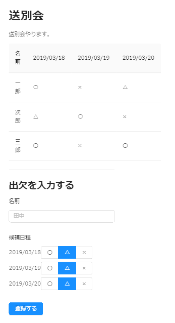

# 2.イベント詳細を表示する

### 画面イメージ




### 対象ファイル

- <project_root>/src/Event.js

### 完成コード

初めに、完成コードを示しておきます。

``` javascript

constructor(props) {
    super(props);
    this.state = {
        participant: {
            name: '',
            candidates: []
        },
        eventDetail: {
            eventId: this.props.match.params.id,
            eventName: '',
            description: '',
            dataSource: [],
            columns: []
        }
    }
}

componentDidMount() {
    this.watchEventDetail();
}

watchEventDetail = () => {
    const eventRef = firebaseDb.ref(`events/${this.props.match.params.id}`);
    eventRef.on("value", snapshot => {
        const { eventDetail, participant } = this.state;
        const event = snapshot.val();
        const { eventName, description, candidateDates } = event;
        const columns = returnColumns(event);
        const dataSource = event.participants ? returnDataSource(event) : null
        const candidates = Object.entries(candidateDates)
                            .map(candidateDate => ({
                                id:candidateDate[0],
                                dateTime:candidateDate[1],
                                answer:'△'
                            }));
        this.setState({
            eventDetail:{...eventDetail, eventName, description, dataSource, columns },
            participant:{...participant, candidates}
        });
    });
}

```

---
## 2-1.ダミーデータを確認しよう

http://localhost:3000/event/1
にアクセスしてみてください。

初期状態ではサーバにアクセスせず、ローカルのダミーデータ(`src/sampleData.js`)を表示するようになっています。
ダミーデータではなく、サーバから取得したデータを表示するようにしましょう。

---
## 2-2.Realtime Databaseからイベント情報を取得しよう

`watchEventDetail関数`にRealtime Databaseからイベント情報を取得する処理を追加していきます。

### 対象ファイル

- <project_root>/src/Event.js

### コード例

``` javascript
componentDidMount() {
    this.watchEventDetail();
}

watchEventDetail = () => {
    const eventRef = firebaseDb.ref(`events/${this.props.match.params.id}`);
    eventRef.on("value", snapshot => {
        const event = snapshot.val();
        console.log(event);
    });
}
```

この関数は[componentDidMount](https://reactjs.org/docs/react-component.html#componentdidmount)から呼び出しているので、
画面遷移した時点で自動的に呼び出されます。

Realtime Databaseからのデータの読み取りに、今回は[valueイベント](https://firebase.google.com/docs/database/web/retrieve-data#value_events)を使用します。

書き込みの時と同じように、`firebase.database.Reference`のインスタンスが必要です。
これは、<project_root>/src/Event.jsの9行目で生成しています。

```javascript
const firebaseDb = firebaseApp.database();
```

以下のように、欲しいオブジェクトのパスを指定すれば`snapshot`からオブジェクトが取得できます。
```javascript
const sampleRef = firebaseDb.ref("パス");
sampleRef.on("value", snapshot => {
  const json = snapshot.val();
}
```

### 2-2-1.イベントIDを取得しよう

今回は、`events/<イベントID>`配下のオブジェクトを取得するため、パスに`イベントID`を含める必要があります。

```json
{
  "events" : {
    "-Lxxxxxxxxxxxxxxx" : {
      "eventName" : "忘年会",
      "description" : "忘年会やります!",
      "candidateDates" : [ "12/29", "12/30" ]
    }
  }
}
```

イベント詳細画面は以下のようなルーティング設定になっています。

```
<Route exact path='/event/:id' component={Event} />
```

URL末尾のIDは、以下のようにReact RouterのAPIから取得できます(propsに自動的に設定されます)。

``` javascript
this.props.match.params.id
```

このような形でイベントのデータが取得できたらOKです。
```json
{
    eventName: "忘年会",
    description: "忘年会やります!",
    candidateDates: [ "12/29", "12/30" ]
}
```
---
## 2-3.取得したデータをstateに格納しよう（確認のみ）

取得したデータを表示させるため、stateに格納します。

stateの構造については、`constructor`を参照してください。
取得したデータを`eventDetail`、`participant`に設定します。

`render`でデータを表示させるために、先程取得したイベントのデータを`setState`しましょう。

コードイメージは以下の通りです。
``` javascript
const json // サーバから取得したJSON
this.setState({
   eventDetail: json
});
```
表示させる必要のある項目は以下の五つです。
* イベント名
* 説明文
* 出欠表(カラム定義)
* 出欠表(データ)
* 候補日程

項目とプロパティの対応は下記の通りです。

| 表示項目           | 対応するプロパティ      |
|--------------------|-------------------------|
| イベント名         | eventDetail.eventName   |
| 説明               | eventDetail.description |
| 出欠表(カラム定義) | eventDetail.columns     |
| 出欠表(データ)     | eventDetail.dataSource  |
| 候補日程           | participant.candidates  |

---
## 2-4.イベント名と説明文を表示させよう

`eventName`、`description`はそのまま`eventDetail`に格納して、`state`の値を参照するようにしましょう。

### 対象ファイル

- <project_root>/src/Event.js

### コード例

``` javascript

watchEventDetail = () => {
    const eventRef = firebaseDb.ref(`events/${this.props.match.params.id}`);
    eventRef.on("value", snapshot => {
        const { eventDetail } = this.state;
        const event = snapshot.val();
        const { eventName, description, candidateDates } = event;
        this.setState({
            eventDetail:{...eventDetail, eventName, description }
        });
    });
}

```

---
## 2-5.候補日程を表示用に編集しよう

画面下段の○×△のボタンを描画するため、Realtime Databaseから取得したデータを編集します。

### 対象ファイル

- <project_root>/src/Event.js

### コード例

```javascript

watchEventDetail = () => {
        const eventRef = firebaseDb.ref(`events/${this.props.match.params.id}`);
        eventRef.on("value", snapshot => {
            const { participant, eventDetail } = this.state;
            const event = snapshot.val();
            const { eventName, description, candidateDates } = event;
            const candidates = Object.entries(candidateDates)
                                .map(candidateDate => ({
                                    id:candidateDate[0],
                                    dateTime:candidateDate[1],
                                    answer:'△'
                                }));
            this.setState({
                eventDetail:{...eventDetail, eventName, description },
                participant:{...participant, candidates}
            });
        });

    };
```

サーバから取得したデータに候補日程の情報が含まれていました。

``` json
candidateDates: [ "8/7(月) 20:00～", "8/8(火) 20:00～", "8/9(水) 21:00～" ]
```

これを`sampleData.js`の以下のようなデータに変換します。

``` javascript
export const candidatesSample = [
    {
        id: 0,
        dateTime: "8/7(月) 20:00～",
        answer: '△'
    },
    {
        id: 1,
        dateTime: "8/8(火) 20:00～",
        answer: '△'
    },
    {
        id: 2,
        dateTime: "8/9(水) 21:00～",
        answer: '△'
    }
];
```

まとめると以下のような編集仕様になります。

| 編集元 | 編集先   | 備考                     |
|--------|----------|--------------------------|
| key    | id       | 候補日程を特定するIDです |
| title  | dateTime | 候補日程                 |
| -      | answer   | '△'固定(初期値)         |

今回は、配列のkeyとvalueを取得したいので、[entries関数](https://developer.mozilla.org/ja/docs/Web/JavaScript/Reference/Global_Objects/Object/entries)でkey:valueからなる配列を取得します。

そして、データの配列を元に新しいデータの配列を作るには[map関数](https://developer.mozilla.org/ja/docs/Web/JavaScript/Reference/Global_Objects/Array/map)を使います。

以下の例では、元オブジェクトのnameに'さん'を付加した新しいオブジェクトの配列を作成しています。

``` javascript
const orig = [{ name: '山田' }, { name: '田中'}];
const san = orig.map(member => {
    return {
        name: member.name + 'さん';
    }
});
console.log(san);
[ { name: '山田さん' }, { name: '田中さん' } ]
```

変換ができたら、その後の`setState`に変換後の値が渡るようにしてください。

``` javascript

        const candidate = ... // 変換後の候補日程
        
        this.setState({
            eventDetail,
            participant: {
                ...this.state.participant,
                candidates
            }
        });
```

うまく変換できていれば、候補日程が表示されます。


---
## 2-6.出欠表を表示させよう

次に`columns`、`dataSource`についてみていきましょう。

`columns`、`dataSource`はAnt Designの[Table](https://ant.design/components/table/)で表示するための項目です。

### 対象ファイル

- <project_root>/src/Event.js

### コード例

``` javascript

watchEventDetail = () => {
    const eventRef = firebaseDb.ref(`events/${this.props.match.params.id}`);
    eventRef.on("value", snapshot => {
        const { eventDetail, participant } = this.state;
        const event = snapshot.val();
        const { eventName, description, candidateDates } = event;
        //コピーする箇所①：ここから
        const columns = returnColumns(event);
        const dataSource = event.participants ? returnDataSource(event) : null
        //コピーする箇所①：ここまで
        const candidates = Object.entries(candidateDates)
                    .map(candidateDate => ({
                        id:candidateDate[0],
                        dateTime:candidateDate[1],
                        answer:'△'
                    }));
        this.setState({
            eventDetail:{...eventDetail, eventName, description, dataSource, columns }, //コピーする箇所②：「, dataSource, columns」
            participant:{...participant, candidates}
        });
    });
}

}

```

今回は、ハンズオンでの実装を簡単にするため、Tableで表示できるようにデータを加工するモジュール`returnColumns関数`,`returnDataSource関数`を用意しました。

これらの関数を使って、出欠表を表示させるためにデータを整形します。

以下のデータを、`returnColumns関数`と`returnDataSource関数`に渡したとします。
```json
{
  eventName: "新年会",
  description: "盛り上がってまいりました",
  candidateDates: [ "8/7(月) 20:00～", "8/8(火) 20:00～", "8/9(水) 21:00～" ],
  participants: {
    part_001: {
      name: "一郎",
      votes: [ "○", "△", "×" ]
    },
    part_002: {
      name: "次郎",
      votes: ["○", "○", "×"]
    }
  }
}
```

`returnColumns関数`はこのようなオブジェクトを返します。
これは、Ant DesignのTableのcolumnsにそのまま設定できるオブジェクトです。
```json
[
  {
    title: '名前',
    dataIndex: 'name',
    key: 'name'
  }, {
    title: '8/7(月) 20:00～',
    dataIndex: "0",
    key: "0"
  }, {
    title: '8/8(火) 20:00～',
    dataIndex: "1",
    key: "1"
  }, {
    title: '8/9(水) 21:00～',
    dataIndex: "2",
    key: "2"
  }
]
```

`returnDataSource関数`は以下のようなオブジェクトを返します。
これも上に同じく、Ant DesignのTableのdataSourceにそのまま設定できるオブジェクトです。

```json
[
  {
    key: "part_001",
    name: '一郎',
    '0': '○',
    '1': '△',
    '2': '×'
  }, {
    key: "part_002",
    name: '次郎',
    '0': '○',
    '1': '○',
    '2': '×'
  }
]
```

ただ、出欠データがない（participantがない）イベントを`returnDataSource関数`に渡すとエラーになってしまうので、participantsが存在する場合のみ`returnDataSource関数`を呼び出す必要があります。

データの整形ができたら、以下のようにテーブルに値が設定できます。

コード例
``` jsx
<Table dataSource={this.state.eventDetail.dataSource} columns={this.state.eventDetail.columns} pagination={false} />
```

### アプリの動作確認

これでアプリが完成したので[イベント登録画面](http://localhost:3000/event)から一通りの動作確認をして見ましょう。

[Firebaseで手動デプロイ](./03_Firebaseで手動デプロイ.md)に進んでください。